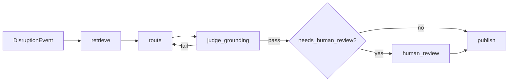

# Architecture overview

The Disruption Router is a LangGraph application that turns a logistics
disruption report into a grounded, auditable routing decision.

## Components

| Layer | Responsibility |
|---|---|
| `router.api` | FastAPI endpoints: `/route`, `/route/stream`, `/reviews` |
| `router.graph` | LangGraph nodes and edges: ingest → retrieve → route → judge → HITL → publish |
| `router.tools` | Rulebook lookup, cost estimation |
| `router.schemas` | Pydantic state, inputs, outputs, and rulebook models |
| `data/` | Source rulebook builder and generated rulebook artifact |
| `evals/` | Layer 1 canonical scenario harness |

## Data flow

## Persistence

Checkpoints are stored in SQLite via `SqliteSaver`. This makes HITL interrupts
durable across process restarts and gives the `/reviews` queue a single source
of truth.
